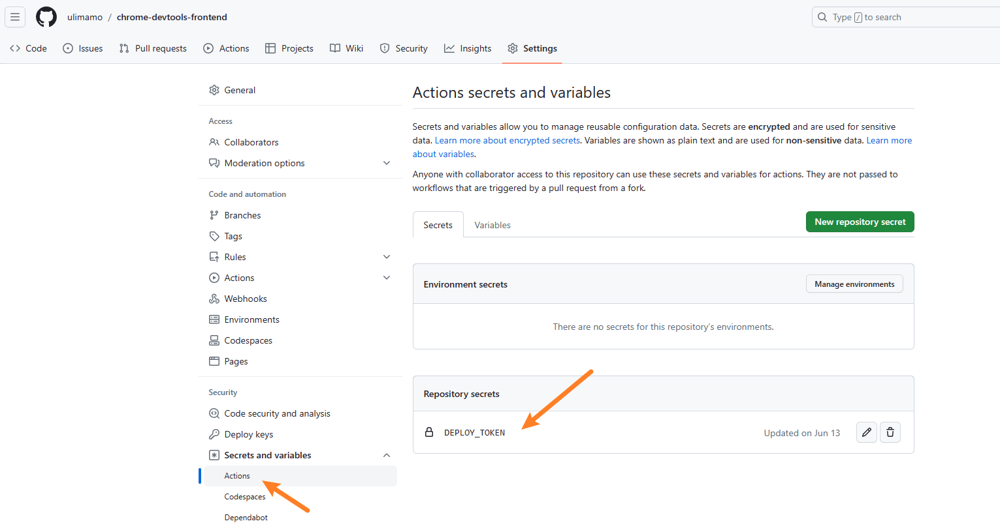
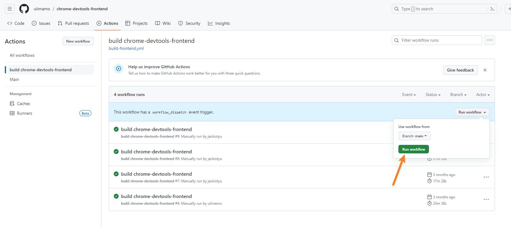

# chrome-devtools-frontend

build chrome-devtools-frontend

## Usage 使用方式

1. Configure `DEPLOY_TOKEN` in Github Actions setting.
在 Github Actions 设置中配置 `DEPLOY_TOKEN`。
> note you'll typically need to [create a personal access token](https://github.com/settings/tokens) with permissions to create releases in the other repo.
> 注意，你需要[创建](https://github.com/settings/tokens)具有在其他存储库中创建发布的权限的个人访问令牌。

2. Run the `build chrome-devtools-frontend` action manually.
手动运行 `build chrome-devtools-frontend` action。

3. Get the release devtools-frontend file.
获取 release 中的 devtools-frontend 文件。